## Multirotor-Design-and-Simulation (Simulink)

This project aims at simulating a multirotor drone using its dynamic equations and some other modules from UAV Library for Robotics System Toolbox such as “UAV guidance model” for autopilot, “UAV animation” to plot the real-time drone position and “Wind” module to create a more realistic environment. 

Unmanned aerial vehicles (UAVs) are autonomous or remotely guided aircraft, which can potentially carry out a wide range of tasks. Multirotor type of UAV has unique ability to perform vertical take-off and landing (VTOL), a stationary and low-speed flight where certain configurations can achieve very complex and precise movements. Therefore, they are suitable for performing tasks such as delivery of first aid kit, firefighting, infrastructure inspection, aerial video, and many others.

   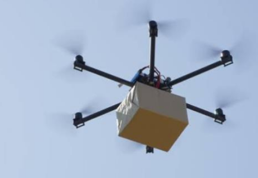

## Multirotor Drone Dynamics
The rotation matrix from body frame to Earth frame is given below. [ψ, ϴ, ϕ] are ZYX Euler angles, in radians. The cos(x) and sin(x) functions are abbreviated as cx and sx.

   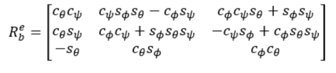

The UAV position in Earth and body frames are respectively [x e , y e , z e ] and [x b , y b , z b ] and angular velocities are [p, q, r] in radians per second.
The acceleration of the UAV center of mass in Earth frame is given by:

   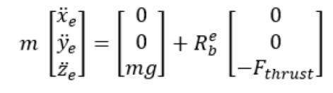

m is the UAV mass, g is gravity, and F thrust is the total force created by the propellers applied to the multirotor along the –z b axis (points upwards in a horizontal pose). The closed-loop roll-pitch attitude controller is approximated by the behavior of 2 independent PD controllers for the two rotation angles, and 2 independent P controllers for the yaw rate and thrust. The angular velocity, angular acceleration, and thrust are given by:

   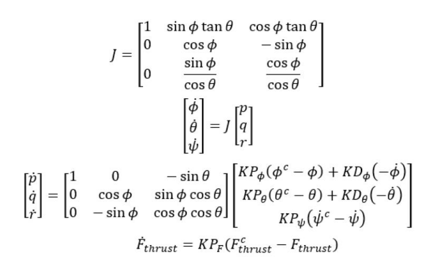

This model assumes that the autopilot takes in commanded roll, pitch, yaw angles, [ψ c , ϴ c , ϕ c ] and a commanded total thrust force, F cthrust . The structure to specify these inputs is generated from control. The P and D gains for the control inputs are specified as KP α and KD α , where α is either the rotation angle or thrust. These gains along with the UAV mass, m, are specified in the Configuration property of the multirotor object.

From these governing equations, the model gives the following variables:

   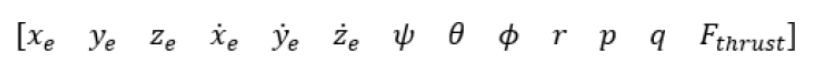

## Implementation of the equations to Matlab function
The function representing the UAV dynamics was implemented as shown below.

   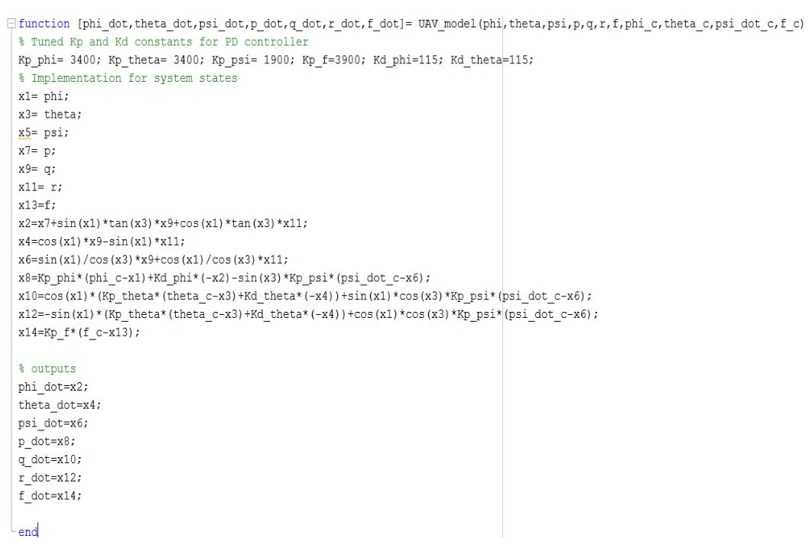

### Adding the UAV guidance module

This module is a reduced-order model for a closed-loop system including an autopilot. The model approximates the behavior of a closed-loop system consisting of an autopilot controller and a kinematic UAV model for 3D motion.

   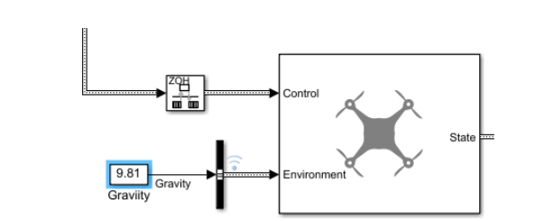

### Adding UAV animation module
Animate a UAV flight path using translations and rotations. This block draws an UAV flight path according to the input translations and rotations relative to the inertial frame. The z-axis of the plot always point upward regardless of the z-axis direction of the inertial frame.
Translation is a 3-element vector representing the xyz-position of the UAV relative to the inertial frame. Rotation is a 4-element quaternion vector representing the rotation of the UAV relative to the inertial frame.

   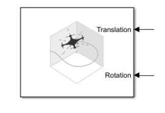

### Adding a wind module
This module generates a discrete wind gust. The gust profile takes the “1-cosine” form.

   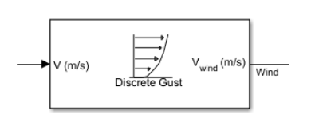

The Simulink model of the system is shown below:

   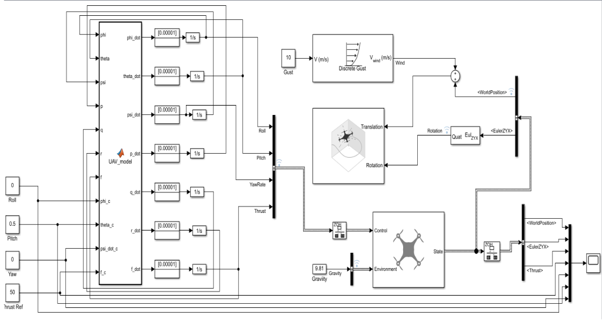

## 3D Motion Visualization
The model was simulated for Roll = 0, Pitch = 0.5, Yaw = 0, and Thrust = 50 command values. The result is shown in the figures below.

   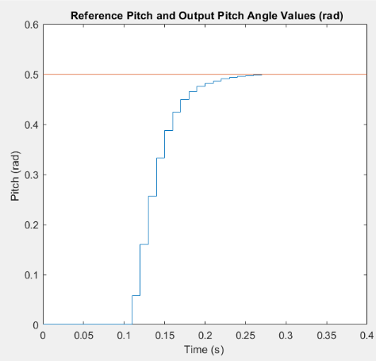

   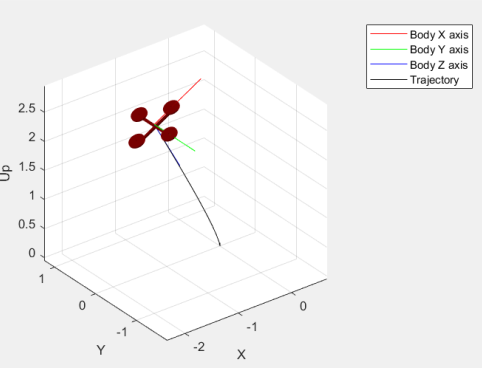

   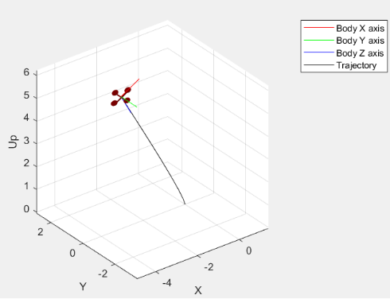

   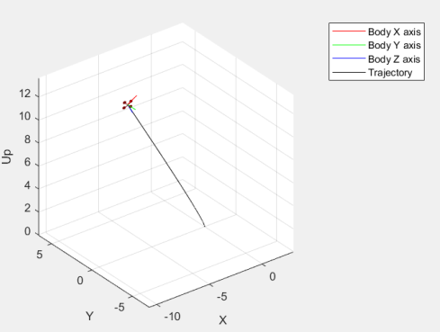

## Dependencies (Linux)
The application depends on [Qt5](https://www.qt.io/). The build script `speakapp_build.sh` installs this dependency. The versions required are Qt 5.12.8 and qmake 3.1. 

## Build Instructions (Ubuntu 16.04 LTS) (Other platforms will be added in the future)
1. Clone this repo.
2. Run the build script `speakapp_build.sh` from the project root folder i.e. where the .pro file exists. If the application is successfully built, the `../build` build directory is created.

## Run Instructions
1. From the build directory `build/`, run the application using `./SpeakAPP`
2. Click on `I'm the boss, I let conversations happen!` button. This will start the server.

3. Choose IP and Port (e.g. `Any` and `50888`) and click on `Connect`.

4. Now, open the application in the first client machine. If you are using `Any` as the server IP, you can open the application in the same machine. Click on `I wanna talk!` button. This will open the application in `Client` mode.

5. Enter IP and Port. If you're running the server and the client on the same machine use the loopback IP 127.0.0.1.

6. Repeat steps 4-5 and open a second client. Now you can send and receive messages between the first and second clients.

## Rubric Points
1. README: `README.md` file.
2. Compiling and Testing: `speakapp_build.sh` script is used to build the project. It uses `qmake` and `make` build system.
3. Loops, Functions, I/O: 
	- The project code is clearly organized into functions and classes. Example: `servercommunication.cpp` file.
	-  The project accepts input from a user as part of the necessary operation. This is done using the GUI. Example: `Mode Window`, `Client Window`, `Server Window`
4. Object Oriented Programming: The project implements OOP principles. Example: `serverwindow.cpp`.
5. Memory Management: The projects uses smart pointers (see `clientwindow.h` and `serverwindow.h`). It also uses Destructors properly and implements RAII.
6. Concurrency: The project is multithreaded. Example: `ServerWindow::showNumberClients()` method in `serverwindow.cpp` source file.

## Authors
* **Fedi Salhi** [Linkedin](https://www.linkedin.com/in/fedisalhi/)

